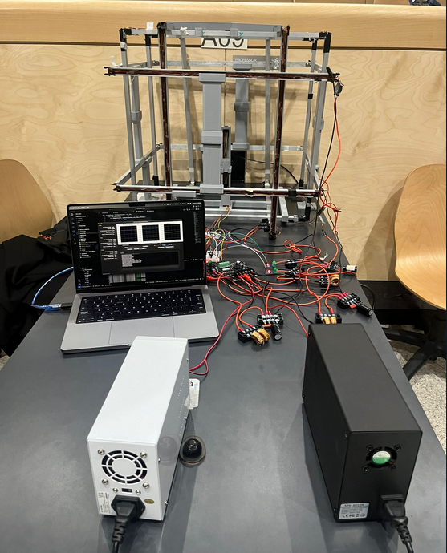
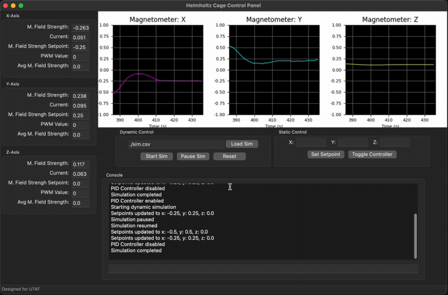

# Helmholtz-Cage

This repo contains the GUI and MCU code for the Helmholtz Cage CubeSat proptotyped for UTAT. The overall setup can be seen below:



This was the 2023-2024 capstone project by Carmen Lamprecht, Rudaina Khalil, and Vimal Raj. 

## Hardware

An Arduino Uno MCU was used to interface with the following

* Magnetometer: QMC5883L (x1)
* Current Sensor: ACS712 (x3)
* Motor Driver (Dual Channel): Cytron MDD20A (x1)
* Motor Driver (Single Channel): Cytron MD20A (x1)

# Requirements and Setup 

## Requirements

- At least python 3.10 or greater
- wxPython 4.0.7 or greater


## Setup 

>     pip install wxPython

or 

>     sudo apt install python3-wxgtk4.0

Note that on linux the version of wxgtk may be slightly different. 

# How to run

On Windows:

>     py main.py 

On Linux/Mac:

>     python3 main.py


# Commands

The following commands can be used in the debug console

```set0```

Set all coils to 0 current


```tune_pid_[axis] [kp] [ki] [kd]```

Adjusts the pid constants of \[axis\], specified by x,y,or z

For example:

>    tune_pid_x 0.001 0.01 0 

will set the coil on the x-axis constants to Kp = 0.001, Ki = 0.01, and Kd = 0


```set_pwm_[axis] [speed]```

will set the pwm for the axis specified by \[axis\], and where \[speed\] is an integer between -255 and 255

```clear```

clears the console output

```reset_avg```

This resets the start of the average magnetic field calculations. Useful for checking the avg of the setpoint

```exit```

closes the GUI window

# The GUI

Here is what the GUI looks like (photo taken from MAC)



The left hand panel has sensor data readings for each of the 3 axes, and the magnetic field is also graphed. The user can set both a static or dynamic magnetic field, and the console for logs and commands is on the bottom. 

## Static Control

The user can opt to set a static field that is then held by the system by inputting the value desired for each axis in the static control box. Once the ```Set Setpoint``` button is clicked, click on ```Toggle Controller``` to enable the feedback loop needed for the PID controller. Dynamic control cannot be used when static control is running. To disable the feedback loop, click on ```Toggle Controller``` again. 

## Dynamic Control

Dynamic Control is essentially a simulation mode. The user can load a simulation CSV file formatted with 

Time(s),Bx(G),By(G),Bz(G)

as the first line. Note that **Time(s)** is a duration (how long the specified magnetic field will be held) and not a timestamp. For an example file see src/sim.csv

# Logging

As an additional feature, while the system is being used there are logs for commands and sensor data to provide session info once the window is closed. Note that these are overwritten at the start of every session. 

# Acknowledgements

Special thanks to Professor Hum for supervising the project